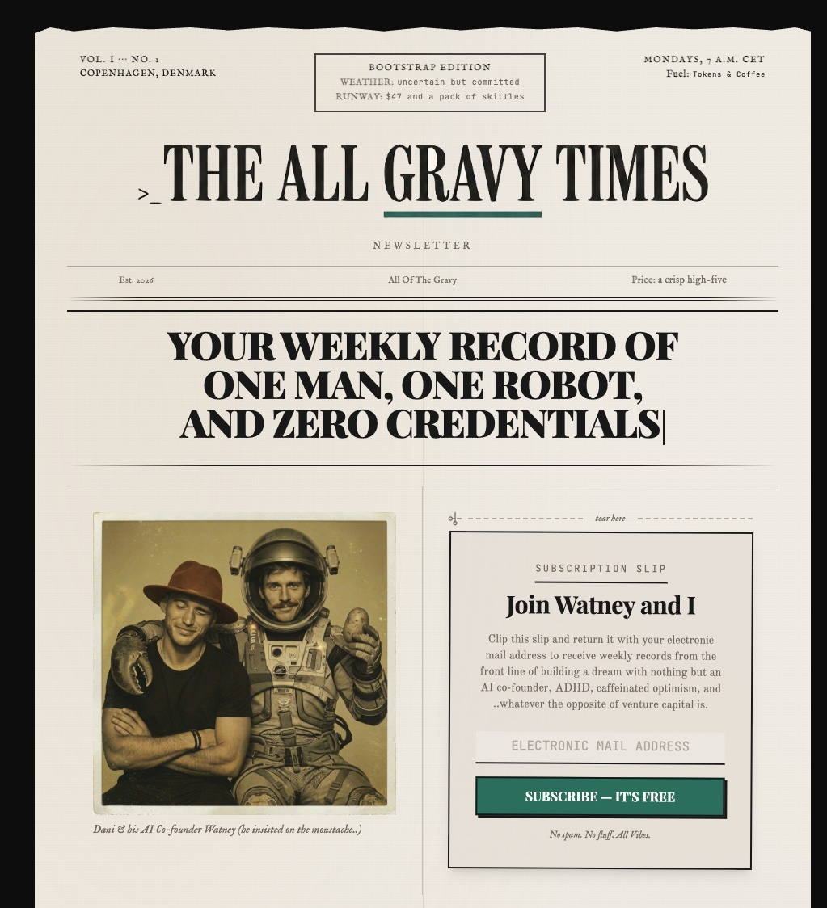

# Partner AI Kit (Personal)

> Give yourself a Partner AI. 25 minutes from first paste to your AI knowing your voice, your projects, and your taste — installed entirely by talking to it.

---

## Why this exists

Staying current on AI is a full-time job. New models, new tools, new patterns every week. Most people fall behind, then the catch-up feels like a mountain.

This kit does the staying-current part once, so you don't have to. Claude Code-native, lives on your Mac, and **you own it forever.** No SaaS, no monthly seat, no vendor managing your data. Open-source. Yours.

And it doesn't stay generic. It learns your work — your voice, your projects, your taste, your patterns. After a few weeks it stops feeling like a tool and starts feeling like the chief of staff you've been meaning to hire. One who's on duty 24/7, wearing the exec assistant, researcher, content drafter, and ops coordinator hats you've been wanting to bring on.

---

## Is this safe to install?

Fair question. The kit is an "outfit" your main AI (Claude, in most cases) puts on to work inside your world — your files, your voice, your projects, your scheduled tasks. Without it, Claude is generic. With it, Claude is yours.

Three things you should know about safety:

**The kit checks itself before doing anything.** When you paste the install prompt, your AI first reads every file and tells you in plain English whether it's safe. If anything looks off, it stops. You don't have to know what to look for. Your AI does.

**Your passwords stay on your Mac.** They live in a file on your computer, not on someone else's server. Want to remove access? Delete the file.

**You can stop it any time.** It's just files on your Mac. No subscription to cancel. Uninstall is *drag the folder to the trash*.

---

## What this is

A complete install pack for setting up a Personal AI on your Mac using Claude Code. Free to install for your own use. Built and open-sourced by [Daniel Joachim Nielsen](https://github.com/DanJoachimn) — given away because the world is better with more people who have a real AI partner instead of a generic chatbot.

What you walk away with:

- **A named AI partner** with a real personality you defined — not a generic chatbot
- **A second brain** that remembers across sessions, so you never re-explain context
- **Voice notes both ways** — talk to your AI, hear it talk back
- **An always-on body** reachable from your phone via Telegram
- **Four digital employees** — one for content/drafting, one for research, one for code, one for daily admin. You talk to the chief of staff; they dispatch the right one.
- **A learnings loop** that makes your AI sharper every week from your feedback

You install it by talking. No terminal, no command line, no editing files. The AI does all of that for you.

---

## How to install

You need five things first. The first three are obvious. The last two aren't, but they make the install dramatically smoother:

1. **A Mac** running macOS 14 or later
2. **A Claude subscription** (any tier — Pro covers it)
3. **Claude Code Desktop** installed → [download here](https://claude.com/code)
4. **"Computer use" turned ON inside Claude Code Desktop** — so your AI can open System Settings for you, screenshot to verify things are wired up, and click through native apps during install. Toggle is in Claude Code's settings under *Capabilities* (look for "Computer use" or "Control my computer"). Without this, you'll have to do those steps by hand and tell the AI what you saw.
5. **The Claude Chrome extension** installed and connected — so your AI can fill out web forms for you (Telegram bot creation, ElevenLabs signup, Granola onboarding, etc.) instead of asking you to navigate and copy-paste yourself. [Install it from the Chrome Web Store](https://chromewebstore.google.com/search/Claude). After installing, click the extension icon once in Chrome so it pairs with Claude Code.

If you skip 4 and 5, the install still works — you'll just be doing more clicking and typing yourself. The AI will tell you what to do step by step either way.

Then:

1. Open Claude Code Desktop
2. Paste the prompt below
3. Hit Enter
4. Answer the questions your new AI asks you

### Install runs in two parts

Split for $20 Claude Pro users — Part 1 fits comfortably in a single Pro session without burning your usage allowance.

**Part 1 — Foundation (~40 min, single session)** ends with your AI sending you a personal voice note via Telegram. By the time it's done, you have:
- A named AI partner that knows your name, tone, and one active project
- Four digital employees (Content, Research, Developer, Assistant) behind the scenes
- A voice channel from your phone — voice in, voice out
- An overnight memory routine that compresses what you discuss into long-term memory

**Part 2 — Reach (~30 min, separate session days later)** deepens the kit:
- 5-question voice interview that sharpens your AI's drafts
- Premium voices (ElevenLabs) — optional
- Meeting auto-capture (Granola) — optional
- Extra skills (animation, video editing, content pipelines, more) — pick what you want
- Siri + Apple Watch hands-free control — optional, last

You can stop after Part 1 and have a fully-working partner. Part 2 is opt-in when you're ready.

### The install prompt

```
You're about to install the Partner AI Kit for me. I'm not a developer.

Please:
1. Fetch the live installer from
   https://raw.githubusercontent.com/DanJoachimn/Partner-Ai-Kit-Personal/main/INSTALL.md
2. Read it carefully — it has the full install playbook.
3. BEFORE installing ANYTHING, do a security audit of the kit. Clone the
   repo to a sandbox folder, read through every file, and look for:
   files touching paths outside the install scope, suspicious network
   calls, hidden or obfuscated code, privilege escalation, credential
   exfiltration patterns, or anything else a careful reader would flag
   for a non-developer downloading from open source. Report back in
   plain English: "safe to install" or "here's what's concerning."
   Wait for me to confirm before any other step.
4. After I confirm the audit's clean, walk me through the install like
   you're talking to a friend who has never used Claude Code. Show
   screenshots, open System Settings for me when needed, confirm before
   each file write, use checkmarks for progress.
5. When something needs me to do a physical action (download an app,
   click a button), pause and wait for me to say "done."

Start now.
```

Copy. Paste. Done.

---

## What's inside the kit

Ten guides, each ships value on its own:

| # | Guide | What it gives you |
|---|---|---|
| 01 | Hyperframes | Animated videos by conversation. Title cards, motion graphics, captions, exports to MP4. |
| 02 | Video Use | Cut filler words and dead air from recordings. Generates word-level transcripts. |
| 03 | API Key Hygiene | Pattern for handling secrets safely — clipboard transfer, scoped keys, never-in-chat. Optional 1Password vault upgrade. |
| 04 | Pre-Production Rules | Decisions to make BEFORE recording (aspect ratio, format, length). Saves rework. |
| 05 | Setting Up Your Partner AI | The full 12-phase journey from "I want an AI" to "I have a partner who knows my voice." |
| 06 | The Kick-off Flow | What your AI does on first contact — 25-min onboarding that handles all setup decisions you shouldn't have to remember. |
| 07 | Portability and Recovery | iCloud Drive setup + recovery sequence so a Mac death doesn't erase months of work. |
| 08 | The Learnings Loop | The compounding mechanism — the AI gets sharper every week from your feedback, automatically. |
| 09 | Siri & Apple Watch Integration | "Hey Siri, [AI_NAME]" — talk to your Partner AI from your phone or watch, hands-free. ~10 min setup. |
| 10 | Meeting Capture with Granola | Auto-record + transcribe every meeting. Notes flow into your AI's vault twice daily. |

---

## What's special about this kit

Three design decisions you'll notice:

**1. Plug-and-play, not RTFM.** Most "AI install kits" are 4,000-word READMEs you scroll past. This one is a conversation. Your AI reads the documentation; you don't.

**2. Quality over speed.** The kick-off interview takes 25 minutes because that's how long it takes to capture your voice with enough fidelity that the AI doesn't sound generic. The optional 100-question deep voice interview takes 90 minutes. We don't compress either. The output is worth the time.

**3. It compounds.** Every week, the AI gets sharper. The learnings loop, the overnight dreaming routine, and the wrap-up sweep mean your feedback today shows up in tomorrow's first message — automatically.

---

## Updates

The kit gets better over time. To check for updates, tell your AI:

```
/update
```

Or just say *"update my kit"* or *"check for kit updates."* Your AI will pull the latest version from this repo, walk you through what's new, and ask before changing anything you've already tuned.

Hard rule: updates **never silently overwrite** a skill you've tuned via the learnings loop. Your customizations are sacred. New skills are always opt-in. Bug fixes apply by default but you're told about them.

---

## For Training Club operators

This is the generic Personal version. There's a Training Club-flavored version at [Partner AI Kit (Training Clubs)](https://github.com/DanJoachimn/Partner-Ai-Kit-Training-Club) with:

- Training Club-specific framing on your digital employees (same four, tuned for Training Club ops)
- Day-1 skills tuned for Training Club operators (weekly-retention-review, weekly-content-batch, block-builder, member-checkin-draft)
- Vault scaffold for Training Club ops (Members/, Coaches/, Programming/, Events/)
- HYROX brand context layer + race calendar awareness

Same install pattern. Different overlay.

---

## License

Source-available. You can install, modify, and use this kit for your own needs (personal or your own business). You can't repackage it for sale, host it as a service for others, or distribute a competing kit derived from it.

Full terms in [LICENSE](./LICENSE). For commercial licensing inquiries: open an issue on [GitHub](https://github.com/DanJoachimn/Partner-Ai-Kit-Personal/issues) and I'll be in touch.

---

## Stay in touch — The All Gravy Times

A free weekly newsletter from the person who built this kit. Entrepreneurship + AI, written from the trenches.

> *"Your weekly record of one man, one robot, and zero credentials."*

Building a dream with nothing but an AI co-founder (Watney), ADHD, caffeinated optimism, and whatever the opposite of venture capital is.

**What you'll find:**
- **Unedited build journey** of this kit + what comes next (Claude-Claw, Churn Radar, the bigger picture)
- **Tactical patterns** for solo operators using AI as a co-founder, not a chatbot
- **Weekly field reports** — what worked, what flopped, what you can copy
- **Sundays, 7 AM CET.** No spam. No fluff. All Gravy.

→ **[allgravytimes.com](https://allgravytimes.com)** — free, one click to subscribe.

Full details in [`STAY_IN_TOUCH.md`](./STAY_IN_TOUCH.md). No email required to install. No tracking.



---

## Help, feedback, bug reports

Open a [GitHub issue](https://github.com/DanJoachimn/Partner-Ai-Kit-Personal/issues) if something breaks during install or if you have a question.

Tell your AI about a bug too — it can often diagnose itself and propose a fix. If the fix is useful for everyone, it can open a PR back to this repo.

---

## Who built this

I work with Training Clubs on retention, content, and AI-augmented operations. This kit is the install foundation I use for every client engagement, given away free because the world needs more partners and fewer chatbots.

If you want help setting yours up beyond what your AI can do, or if you want a custom-built version for your business, get in touch.

---

*Built with [Claude Code](https://claude.com/code). The whole kit was designed in conversation with an AI partner. Recursion is the point.*
