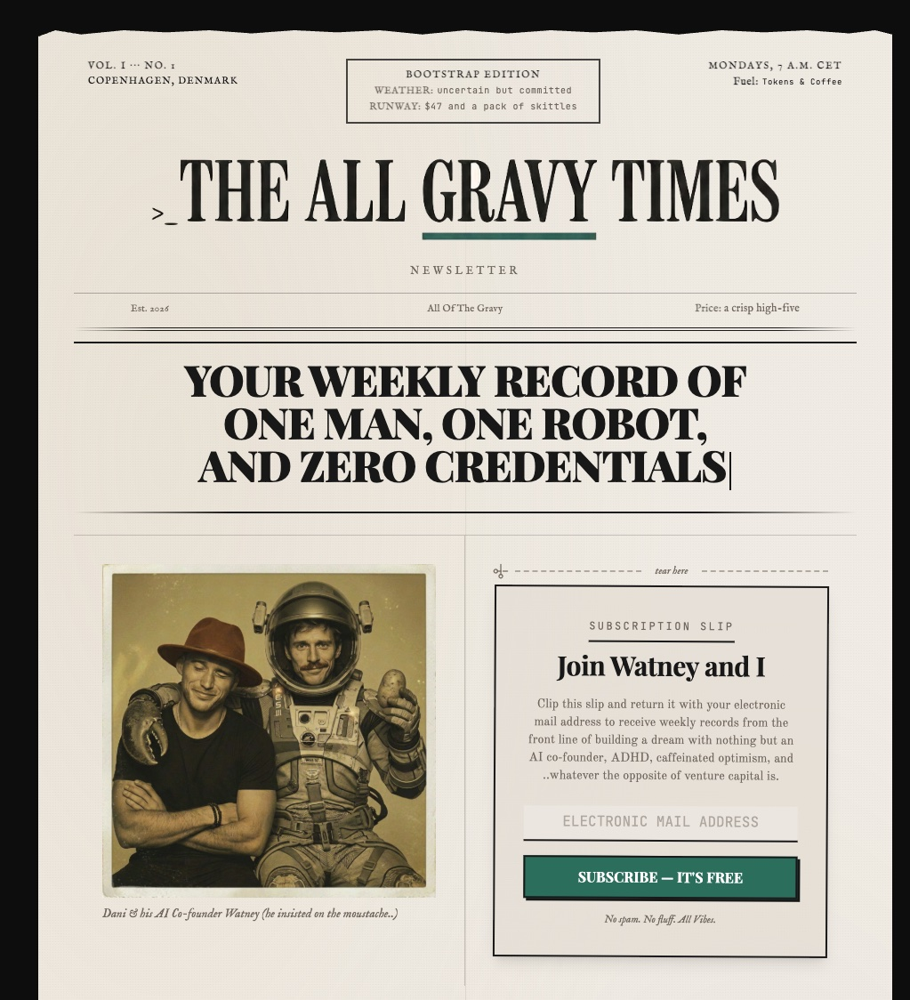

# WATNEY: Personal AI-OS Kit

> Give yourself a Partner AI. From first paste to your AI knowing your voice, your projects, and your taste — installed entirely by talking to it like a nerdy friend.

"Mate, explain this to me like we're back in 8th grade."

---

## What's WATNEY?

**WATNEY is the kit's name** — homage to *The Martian* (the Mark Watney you'd want stranded on your Mac instead of Mars: practical, resourceful, doesn't quit, makes the best of what's there).

It's not the name of your AI. The AI you install with this kit gets whatever name **you** pick during kick-off.

---

## Why this exists

It runs on Claude Code, lives on your Mac, and **you own it forever.** No SaaS, no monthly seat, no vendor managing your data. Open-source. Yours.

And it doesn't stay generic. It learns your work — your voice, your projects, your taste, your patterns. After a few weeks it stops feeling like a tool and starts feeling like the chief of staff you've been meaning to hire. One who's on duty 24/7, wearing the exec assistant, researcher, content drafter, and ops coordinator hats you've been wanting to bring on.

---

## Is this safe to install?

Fair question. The kit is an "outfit" your main AI (Claude, in most cases) puts on to work inside your world — your files, your voice, your projects, your scheduled tasks. Without it, Claude is generic. With it, Claude is yours.

Three things you should know about safety:

**The kit checks itself before doing anything.** When you paste the install prompt, your AI first reads every file and tells you in plain English whether it's safe. If anything looks off, it stops. You don't have to know what to look for. Your AI does.

**Your passwords stay on your Mac.** They live in a file on your computer, not on someone else's server. Want to remove access? Delete the file.

**You can stop it any time.** It's just files on your Mac. No subscription to cancel. Uninstall is *drag the folder to the trash*.

---

## What this is

A complete install pack for setting up a Personal AI on your Mac using Claude Code. Free to install for your own use. Built and open-sourced by [Daniel Joachim Nielsen](https://github.com/DanJoachimn) — given away because the world is better with more people who have a real AI partner instead of a generic chatbot.

What you walk away with:

- **A named AI partner** with a real personality you defined — not a generic chatbot
- **A second brain** that remembers across sessions, so you never re-explain context
- **Voice notes both ways** — talk to your AI, hear it talk back
- **A body in your pocket** — text or voice-note it from your phone via Telegram (replies within a minute while your Mac's awake; asleep, messages queue and it catches up on wake)
- **Four helpers behind the scenes** — a writer, a researcher, a builder and an assistant. You only ever talk to your AI. It hands each job to the right helper.
- **A learnings loop** that makes your AI sharper every week from your feedback

You install it by talking. No terminal, no command line, no editing files. The AI does all of that for you.

---

## What it costs

The kit is **free, forever**. It's files you own. The services it runs on aren't:

| | Cost | Required? | Why |
|---|---|---|---|
| **Claude subscription** | $20/mo (Pro), $100+/mo (Max) for heavy use | **Required** | The intelligence. Pro covers the install and daily use. Upgrade only if you keep hitting limits. |
| Telegram | Free | Required for the phone line | Your AI in your pocket |
| ElevenLabs | Free tier, ~$5/mo+ for more | Optional | A nicer voice than the Mac's built-in one |
| fal.ai | Pennies per image | Optional | Image generation |
| 1Password | ~$3/mo | Optional | A safer home for your keys |

**Realistic minimum: $20/mo.** For an assistant that's on duty every day and gets sharper every week, that's the cheapest hire you'll ever make.

---

## How to install

### What you need

1. **A Mac** on macOS 14 or newer
2. **A Claude subscription.** Pro is enough.
3. **The Claude desktop app** → [download here](https://claude.com/code)
4. **Computer use switched on.** In the app: **Settings → Capabilities → Computer use**. Say yes when your Mac asks about Screen Recording and Accessibility.
5. **The Claude Chrome extension** → [Chrome Web Store](https://chromewebstore.google.com/search/Claude). Click its icon once in Chrome so it links up.

**Don't skip 4 and 5.** They're the difference between an AI that describes what to click and one that clicks it. A chatbot says *"open System Settings and find the toggle."* With these switched on, your AI opens System Settings, finds the toggle and shows you. Without them the install still works, but you do the clicking.

You don't need to prepare anything else. Apps like Gmail, Calendar, Drive and Apple Notes get connected at the end, and your AI walks you through each one.

### Then

1. Open the Claude desktop app and start a new Code session
2. Paste the install prompt below and press Enter
3. Answer your new AI's questions

### It runs in two parts

**Part 1: about 75 minutes.** It's mostly your AI working while you answer questions, and it ends with your AI sending you a voice note on Telegram. You'll have:
- An AI with a name that knows who you are and one project you're working on
- Four helpers behind the scenes: a writer, a researcher, a builder and an assistant
- A line from your phone, by text or voice
- A memory that tidies itself up every night

**Part 2: about 30 minutes, a few days later.** Optional extras:
- A short voice interview, so drafts sound more like you
- Better voices from ElevenLabs
- Extra skills like video editing and content pipelines. Pick what you want.

Part 1 on its own gives you a fully working AI. Part 2 is there when you want it.

### Two skills to try on day one

Both install during the first few minutes, straight after the safety check. They're also the quickest way to feel the difference between a chatbot and a partner.

| Skill | Try it by saying | What it's for | In the kit |
|---|---|---|---|
| **`/waitwhat`** | `/waitwhat` | The last explanation didn't land. It tries again from a different angle, in plain English. | [`setup-guide/command-templates/waitwhat.md`](./setup-guide/command-templates/waitwhat.md) |
| **LLM Council** | *"council this: should I raise my prices or add a cheaper tier?"* | A real decision gets argued by five advisors who think differently, then boiled down to one verdict. | [`setup-guide/skill-templates/llm-council/SKILL.md`](./setup-guide/skill-templates/llm-council/SKILL.md) |

**Just want these two, without the full install?** Paste this into Claude Code:

```
Install two skills from the WATNEY kit for me. Read each file first and tell me in one line what it does before installing:
1. https://raw.githubusercontent.com/DanJoachimn/WATNEY-Personal-Ai-OS-Kit/main/setup-guide/command-templates/waitwhat.md
   → save to ~/.claude/commands/waitwhat.md
2. https://raw.githubusercontent.com/DanJoachimn/WATNEY-Personal-Ai-OS-Kit/main/setup-guide/skill-templates/llm-council/SKILL.md
   → save to ~/.claude/skills/llm-council/SKILL.md
Replace [AI_NAME] with "you" and [PARTNER_NAME] with my first name in both files. Then show me each one working.
```

### The install prompt

```
You're about to install WATNEY (the Personal AI-OS Kit) for me. I'm not a developer.

Please:
1. Fetch the live installer from
   https://raw.githubusercontent.com/DanJoachimn/WATNEY-Personal-Ai-OS-Kit/main/INSTALL.md
2. Read it carefully — it has the full install playbook.
3. BEFORE installing ANYTHING, do a security audit of the kit. Clone the
   repo to a sandbox folder, read through every file, and look for:
   files touching paths outside the install scope, suspicious network
   calls, hidden or obfuscated code, privilege escalation, credential
   exfiltration patterns, or anything else a careful reader would flag
   for a non-developer downloading from open source. Report back in
   plain English: "safe to install" or "here's what's concerning."
   Wait for me to confirm before any other step.
4. After I confirm the audit's clean, walk me through the install like
   you're talking to a friend who has never used Claude Code. Show
   screenshots, open System Settings for me when needed, confirm before
   each file write, use checkmarks for progress.
5. When something needs me to do a physical action (download an app,
   click a button), pause and wait for me to say "done."

Start now.
```

Copy. Paste. Done.

**On Windows?** The kit is built and tested on macOS. But because it's a playbook your AI reads (not compiled software), Windows installs have worked — the AI adapts the Mac-specific parts (scheduling, file paths) to Windows equivalents live during install. Consider yourself a pioneer, and expect your AI to improvise a little.

---

## What's inside the kit

Five short guides for when you want to know how something works. Your AI has read them all, so you only open one if you're curious.

| Guide | What it's for |
|---|---|
| [01 - Keeping Keys Safe](./01%20-%20Keeping%20Keys%20Safe/api-key-hygiene.md) | How to give your AI a password or API key without pasting it into the chat |
| [02 - How Setup Works](./02%20-%20How%20Setup%20Works/setting-up.md) | The whole journey, from a blank Mac to an AI that knows how you work |
| [03 - Your First Chat](./03%20-%20Your%20First%20Chat/kick-off.md) | What your AI asks the first time you talk, and why |
| [04 - Backup and Recovery](./04%20-%20Backup%20and%20Recovery/portability.md) | Keeping your AI safe if your Mac dies. Being rewritten, so for now use the backup step in Part 2. |
| [05 - How It Learns](./05%20-%20How%20It%20Learns/learnings-loop.md) | How your feedback makes it sharper every week |

---

## Standing on shoulders — Anthropic's knowledge-work-plugins

This kit installs and references **[anthropics/knowledge-work-plugins](https://github.com/anthropics/knowledge-work-plugins)** — a public Anthropic-maintained plugin marketplace.

The kit:
- Installs a curated set during Part 2 of kick-off: `productivity`, `enterprise-search`, and `brand-voice` (the personal-AI foundation)
- Pulls upstream updates whenever you run `/update`
- Stays out of the way — the kit's own skills wrap, never replace, the upstream ones

The full default-install list, optional add-ons (`marketing`, `cowork-plugin-management`), update behavior, and architectural rationale are documented in [KNOWLEDGE-WORK-PLUGINS.md](./KNOWLEDGE-WORK-PLUGINS.md).

**Why "wrap, don't fork":** Anthropic maintains the heavy lifting; this kit adds the personal-AI sauce on top. When Anthropic ships better plugins, you get them for free.

---

## What's special about this kit

Three design decisions you'll notice:

**1. Plug-and-play, not RTFM.** Most "AI install kits" are 4,000-word READMEs you scroll past. This one is a conversation. Your AI reads the documentation; you don't.

**2. Quality over speed.** The kick-off interview takes 25 minutes because that's how long it takes to capture your voice with enough fidelity that the AI doesn't sound generic. The optional 100-question deep voice interview takes 90 minutes. We don't compress either. The output is worth the time.

**3. It compounds.** Every week, the AI gets sharper. The learnings loop, the overnight dreaming routine, and the wrap-up sweep mean your feedback today shows up in tomorrow's first message — automatically.

---

## Updates

The kit gets better over time. To check for updates, tell your AI:

```
/update
```

Or just say *"update my kit"* or *"check for kit updates."* Your AI will pull the latest version from this repo, walk you through what's new, and ask before changing anything you've already tuned.

Hard rule: updates **never silently overwrite** a skill you've tuned via the learnings loop. Your customizations are sacred. New skills are always opt-in. Bug fixes apply by default but you're told about them.

---

## License

Source-available. You can install, modify, and use this kit for your own needs (personal or your own business). You can't repackage it for sale, host it as a service for others, or distribute a competing kit derived from it.

Full terms in [LICENSE](./LICENSE). For commercial licensing inquiries: open an issue on [GitHub](https://github.com/DanJoachimn/WATNEY-Personal-Ai-OS-Kit/issues) and I'll be in touch.

---

## Stay in touch — The All Gravy Times

A free weekly newsletter from the person who built this kit. Entrepreneurship + AI, written from the trenches.

> *"Your weekly record of one man, one robot, and zero credentials."*

Building a dream with nothing but an AI co-founder (Watney), ADHD, caffeinated optimism, and whatever the opposite of venture capital is.

**What you'll find:**
- **Unedited build journey** of this kit + what comes next (Claude-Claw, Churn Radar, the bigger picture)
- **Tactical patterns** for solo operators using AI as a co-founder, not a chatbot
- **Weekly field reports** — what worked, what flopped, what you can copy
- **Sundays, 7 AM CET.** No spam. No fluff. All Gravy.

→ **[allgravytimes.com](https://allgravytimes.com)** — free, one click to subscribe.

*Presented with [Beehiiv](https://www.beehiiv.com?via=daniel-joachim-nielsen).*

Full details in [`STAY_IN_TOUCH.md`](./STAY_IN_TOUCH.md). No email required to install. No tracking.



---

## Help, feedback, bug reports

Open a [GitHub issue](https://github.com/DanJoachimn/WATNEY-Personal-Ai-OS-Kit/issues) if something breaks during install or if you have a question.

Tell your AI about a bug too — it can often diagnose itself and propose a fix. If the fix is useful for everyone, it can open a PR back to this repo.

---

## Who built this

I work with Training Clubs on retention, content, and AI-augmented operations. This kit is the install foundation I use for every client engagement, given away free because the world needs more partners and fewer chatbots.

If you want help setting yours up beyond what your AI can do, or if you want a custom-built version for your business, get in touch.

---

*Built with [Claude Code](https://claude.com/code). The whole kit was designed in conversation with an AI partner. Recursion is the point.*
