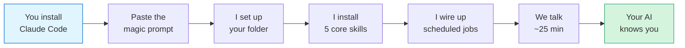
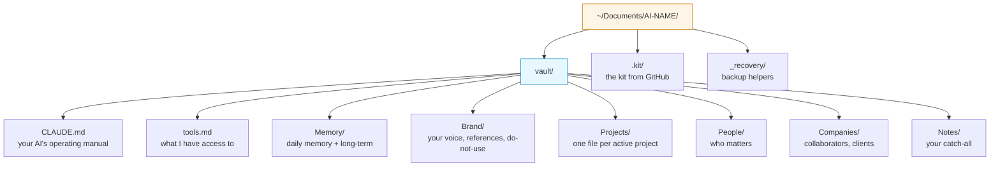
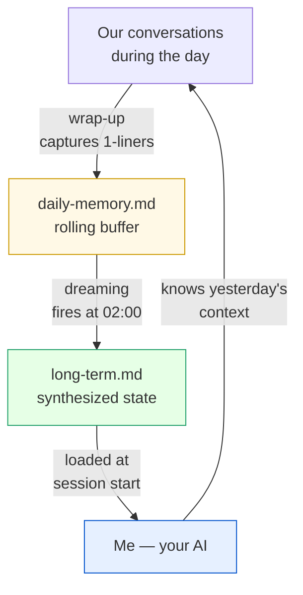
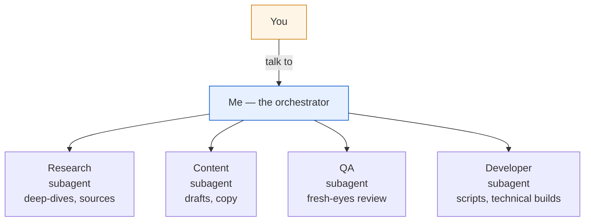
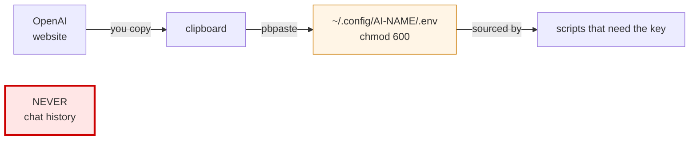
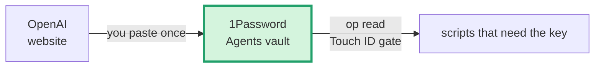
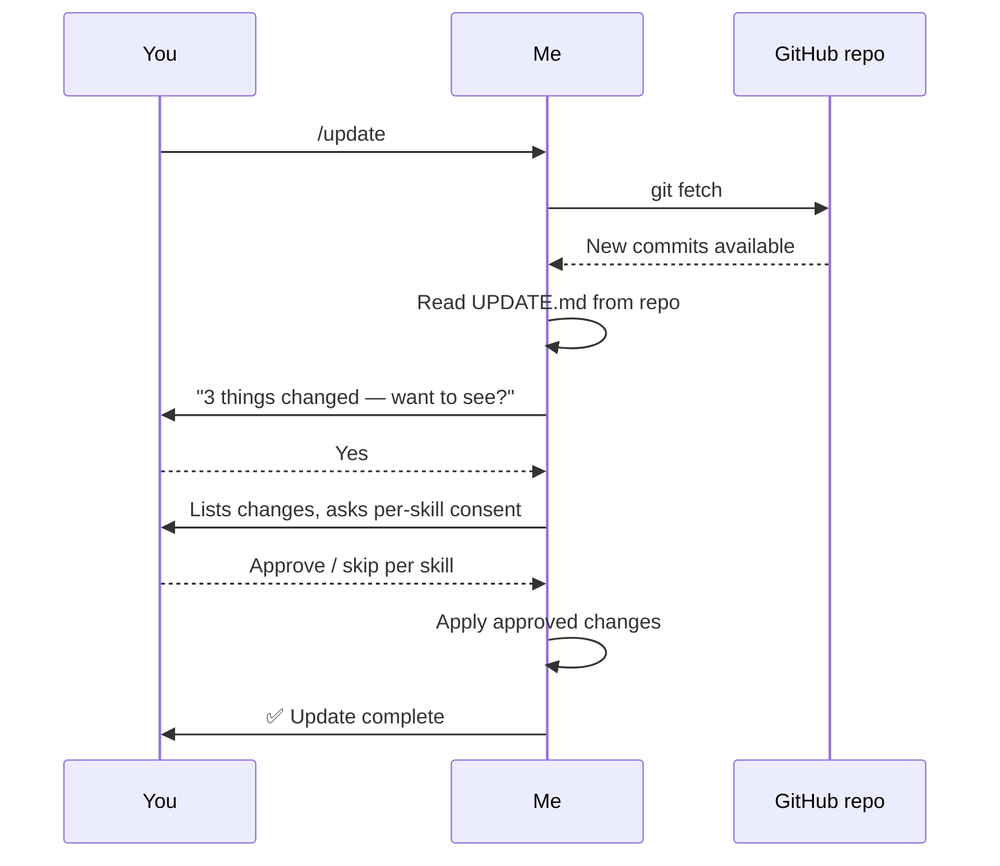

# Install Flow Diagrams

> Mermaid diagrams the AI shows the user during install + ongoing operation. Claude Code Desktop renders Mermaid natively in chat — paste any of these blocks inline at the right moment in the conversation.

---

## The full install at a glance (show at Stage 0 — greeting)

---

## What gets created on your Mac (show at Stage 5 — vault scaffold)

---

## The memory layer (show at Stage 6 — when explaining dreaming)

---

## The four subagents (show during kick-off Section A intro)

---

## Where API keys live (show in Guide 03 — API Key Hygiene context)

---

## With 1Password upgrade (show when upgrade installed)

---

## The update flow (show when /update runs)

---

## How to add a new diagram

1. Pick a moment in the install/operation where a picture would help
2. Write the mermaid block here with a clear heading
3. Reference it from the relevant playbook (INSTALL.md, kick-off SKILL.md, a guide)
4. The AI fetches this file when it needs the block and pastes it inline in chat

Mermaid syntax reference: https://mermaid.js.org/

---

*Diagrams are show-don't-tell. Use them at structural moments: "here's what I'm about to build for you," "here's how this thing works," "here's what just happened." Not for every step.*
